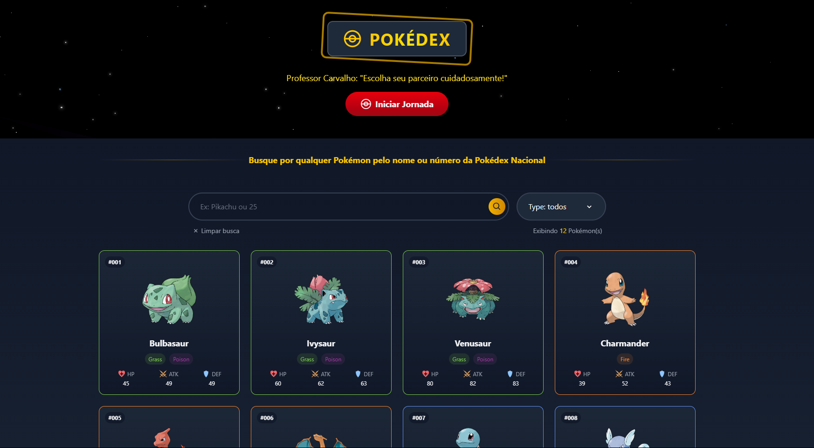

#  Pokémon Info Modal

Um modal lateral animado e interativo desenvolvido com **React**, que exibe informações completas de um Pokémon consumindo dados diretamente da **[PokéAPI](https://pokeapi.co/)**. Ideal para ser utilizado em uma Pokédex ou qualquer projeto que envolva dados de Pokémon.



---

## ✨ Funcionalidades

- 🌀 **Animações suaves** com framer-motion (Pokébola e Pokémon animados)
- 📜 **Descrição oficial** (flavor text) do Pokémon
- 🧠 **Habilidades** com indicação de habilidades ocultas
- ⚔️ **Estatísticas base** (ataque, defesa, velocidade etc.)
- 🧭 **Altura, peso, tipo e experiência**
- 🔁 **Próxima evolução**, se disponível
- 🎨 Estilização dinâmica baseada no tipo do Pokémon
- 💻 Componente 100% responsivo


---

## 📦 Tecnologias Utilizadas

- [React](https://reactjs.org/)
- [TypeScript](https://www.typescriptlang.org/)
- [Framer Motion](https://www.framer.com/motion/)
- [Tailwind CSS](https://tailwindcss.com/) *(ou classes utilitárias personalizadas)*
- [PokéAPI](https://pokeapi.co/)
- [React Icons](https://react-icons.github.io/react-icons/)

---

## 🔧 Instalação

1. Clone o repositório:

```bash
git clone https://github.com/seu-usuario/pokemon-modal.git
